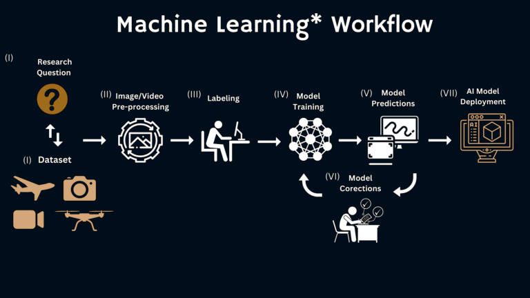

## **W**ildlife **F**rom **S**pace **AI** - **wfsai**  
A pip installable python package to help with the AI workflow stages of detecting Wildlife from Space.  

The features of the `wfsai` package include:  

- Handling configuration based AI pipeline workflow/execution.
- Setting up reproducible file/directory compute environments.
- Retrieving local and remote datasets/configs.
- Ortho-rectification of VHR satellite imagery (using GDAL).
- Pan-sharpening of VHR satellite imagery (using GDAL, "weighted" Brovey algorithm).
- Tiling of VHR satellite imagery.
- Masking of VHR satellite imagery to shapefile with optional shapefile dilation.

---

Documentation for this package is hosted [here](https://antarctica.github.io/wfsai)

---

This python package aims to integrate with the common AI workflow shown in the diagram below:  

  
(diagram courtesy of [this](https://blogs.oregonstate.edu/gemmlab/2024/12/23/demystifying-ai-a-brief-overview-of-image-pre-processing-and-a-machine-learning-workflow/) blogpost. original diagram [here](https://osu-wams-blogs-uploads.s3.amazonaws.com/blogs.dir/2115/files/2024/12/A.I.-Model-768x432.png))

---

## Installation
Requires Python >=3.10

> ### pip
> `pip install git+https://github.com/antarctica/wfsai.git@main`

> ### conda/mamba
> `conda/mamba create -n <environment-name> -c conda-forge git pip`  
> `conda/mamba activate <environment-name>`  
> `pip install git+https://github.com/antarctica/wfsai.git@main`  

### GDAL
Some of the modules within this `wfsai` package make use of the **gdal** python implementation, including it's underlying dependencies. We found that the best way to handle **gdal** and it's dependencies is to use a mamba environment with the mamba dependency solver. If you are using a conda/mamba environment in your project then simply include **gdal** as a dependency in your environment.yaml or use the command:  
> `conda install -n <environment-name> -c conda-forge gdal`  

## Environment Variables
If retrieving a configuration from a remote repository then specify the `REMOTE_CONFIG_REPO` environment variable.
```bash
REMOTE_CONFIG_REPO=<url>
```  
With either remote or local config files, you should specify the `CONFIG_FILE` environment variable.
```bash
CONFIG_FILE=<config filename>
```

From the diagram above, often the first step of AI workflow is to obtain a source dataset to answer a scientific question. Datasets may be remote or local to the working environment and it is helpful to set out a framework for how the data will be handled during the workflow.  
For example:
- `configuration files -> retrieving/linking of input files -> intermediate files -> outputs.`

## Usage (cli)
### wfsai **--help**
*show the built-in help for the wfsai package command line interface (cli)*  
